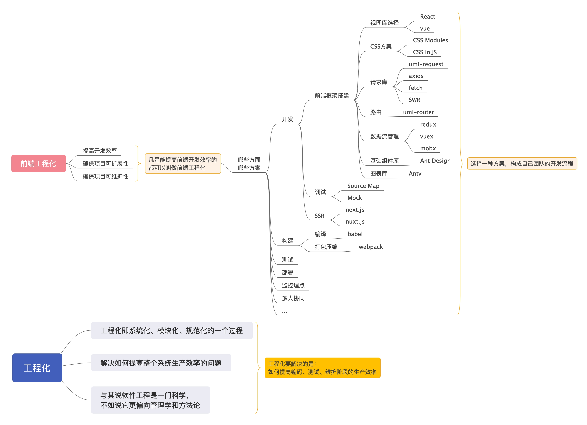
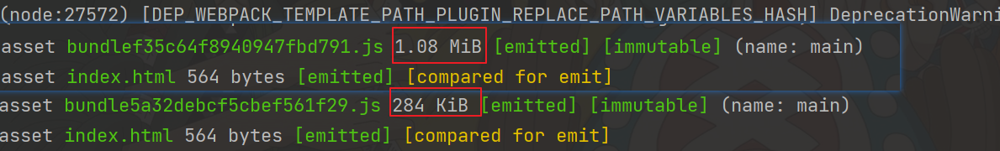

# webpack
## 前端工程化
开局一张图 

介绍 webpack 之前先了解一下前端工程化
这里有一篇文章介绍的比较详细 [前端工程化](https://www.mengfansheng.com/2020/01/01/%E5%89%8D%E7%AB%AF%E5%B7%A5%E7%A8%8B%E5%8C%96/)

> 前端工程化工具
> - 脚手架工具
> - 打包构建工具
> - 测试工具
> - 自动化工具

## webpack OR gulp

#### Gulp 是什么
gulp是一个基于流的构建工具，可以自动执行指定的任务，简洁且高效
#### Gulp 能做什么？
- 开发环境下，想要能够按模块组织代码，监听实时变化
- css/js预编译，postcss等方案，浏览器前缀自动补全等
- 条件输出不同的网页，比如app页面和mobile页面
- 线上环境下，我想要合并、压缩 html/css/javascritp/图片，减少网络请求，同时降低网络负担
- 等等...

#### webpack 是什么？
webpack是模块化打包工具，使用webpack可以对模块进行压缩、预处理、按需打包、按需加载等。
####  webpack 有哪些重要特征？
- 插件化：webpack本身非常灵活，提供了丰富的插件接口。基于这些接口，webpack开发了很多插件作为内置功能。
- 速度快：webpack使用异步IO以及多级缓存机制。所以webpack的速度是很快的，尤其是增量更新。
- 丰富的Loaders：loaders用来对文件做预处理。这样webpack就可以打包任何静态文件。
- 高适配性：webpack同时支持AMD/CommonJs/ES6模块方案。webpack会静态解析你的代码，自动帮你管理他们的依赖关系。此外，webpack对第三方库的兼容性很好。
- 代码拆分：webpack可以将你的代码分片，从而实现按需打包。这种机制可以保证页面只加载需要的JS代码，减少首次请求的时间。
- 优化：webpack提供了很多优化机制来减少打包输出的文件大小，不仅如此，它还提供了hash机制，来解决浏览器缓存问题。
- 开发模式友好：webpack为开发模式也提供了很多辅助功能。比如SourceMap、热更新等。
- 使用场景多：webpack不仅适用于web应用场景，也适用于Webworkers、Node.js场景

参考文章： [Gulp 和 webpack 入门](https://juejin.cn/post/6844903850663493639)

## 模块化
随着前端页面复杂性增加，嵌入网页的 JavaScript 代码越来越庞大， 越来越复杂，
原生开发的 JavaScript 代码变得越来越难管理， 难以维护


Javascript模块化编程，已经成为一个迫切的需求。理想情况下，开发者只需要实现核心的业务逻辑，其他都可以加载别人已经写好的模块。

学习 JavaScript 语言，你会发现它有两种格式的模块。

- 一种是 ES6 模块，简称 ESM；
- 另一种是 Node.js 专用的 CommonJS 模块，简称 CJS。 

这两种模块不兼容。
#### 两种模块的差异
ES6 模块和 CommonJS 模块有很大的差异。

语法上面，CommonJS 模块使用require()加载和module.exports输出，ES6 模块使用import和export。

用法上面，require()是同步加载，后面的代码必须等待这个命令执行完，才会执行。import命令则是异步加载，或者更准确地说，ES6 模块有一个独立的静态解析阶段，依赖关系的分析是在那个阶段完成的，最底层的模块第一个执行。

使用示例：
* AMD
  ```javascript
  // math.js
  define(function () {
    function add(a, b) {
      return a + b
    }
    return { add }
  })
  
  // index.js
  (function() {
    require(['math'], function(math) {
      console.log(math.add(1, 2))
    });
  })()
  ```
* CommonJS
    ```javascript
    // math.js
    function add(a, b) {
      return a + b
    }
    
    module.exports = {
      add
    }
    
    // index.js
    const math = require('./math.js')
    console.log(math.add(1, 2))
    ```
* MSM
  ```javascript
  // math.js
  export function add(a, b) {
    return a + b
  }
  // index.js
  import { add } from './math'
  
  console.log(add(1, 2))
  ```

参考文章：
- [Javascript模块化编程 (一)](https://www.ruanyifeng.com/blog/2012/10/javascript_module.html)
- [Javascript模块化编程 (二)](https://www.ruanyifeng.com/blog/2012/10/asynchronous_module_definition.html)
- [Javascript模块化编程 (三)](https://www.ruanyifeng.com/blog/2012/11/require_js.html)
- [最详细、最全面的“前端模块化”总结](https://juejin.cn/post/6844904133011439623)

## Hello World
初始化项目, 生成包管理文件 `package.json`
```shell
npm init -y
```
安装 webpack
```shell
npm i webpack webpack-cli -D
```
在文件根目录创建 `src` 目录， 并添加 `index.js`
```javascript
console.log('Hello World!')
```
执行命令
```shell
npx webpack ./src/index.js
```

## 模块打包
webpack 是一个用于现代 JavaScript 应用程序的 静态模块打包工具。
当 webpack 处理应用程序时，它会在内部构建一个 依赖图(dependency graph)，
此依赖图对应映射到项目所需的每个模块，并生成一个或多个 bundle。

## `srcipt` 打包命令
在 `package.json` 里面可以配置打包命令

```json
{
  "scripts": {
      "bundle": "webpack"
  }
}
```

配置完成后可以直接运行 `npm run bundle` 进行打包

打包后两个问题：
1. 打包后文件为什么叫 main.js
2. 打包后文件夹为什么是 dist

## webpack.config.js
webpack 打包可以通过 `webpack.config.js` 文件进行配置
```javascript
module.exports = {
  entry: './src/index.js',
  output: {
    filename: 'bundle.js',
    path: path.resolve(__dirname, 'bundle')
  }
}
```
* `entry` 入口起点(entry point) 指示 webpack 应该使用哪个模块，来作为构建其内部 依赖图(dependency graph) 的开始。进入入口起点后，webpack 会找出有哪些模块和库是入口起点（直接和间接）依赖的。
* `output` output 属性告诉 webpack 在哪里输出它所创建的 bundle，以及如何命名这些文件。主要输出文件的默认值是 ./dist/main.js，其他生成文件默认放置在 ./dist 文件夹中

## 模式（mode）
#### 用法
只需在配置对象中提供 mode 选项：
```javascript
module.exports = {
  mode: 'development',
};
```
或者从 CLI 参数中传递：
```shell
webpack --mode=development
```
支持以下字符串值：

| **选项**    | **描述**                                                     |
| ----------- | ------------------------------------------------------------ |
| development | 会将 `DefinePlugin` 中 `process.env.NODE_ENV` 的值设置为 `development`. 为模块和 chunk 启用有效的名。 |
| production  | 会将 `DefinePlugin` 中 `process.env.NODE_ENV` 的值设置为 `production`。为模块和 chunk 启用确定性的混淆名称，`FlagDependencyUsagePlugin`，`FlagIncludedChunksPlugin`，`ModuleConcatenationPlugin`，`NoEmitOnErrorsPlugin` 和 `TerserPlugin` 。 |
| none        | 不使用任何默认优化选项                                       |

## devtool
此选项控制是否生成，以及如何生成 source map。

sourceMap 它是一个映射关系，打包后代码与源代码的映射关系

选择一种 source map 格式来增强调试过程。不同的值会明显影响到构建(build)和重新构建(rebuild)的速度。

#### source-map

构建速度变慢， 打包速度变慢

#### inline-source-map

将 map 文件 变成 base64 文件

#### eval-source-map

以 eval 的形式解析映射关系， 打包速度较快， 但是报错信息可能不太准确

#### cheap-source-map

只显示代码行位置， 忽略列位置

#### model-source-map

将安装依赖的错误也映射出

#### 最佳实践

* **测试环境**  `eval-cheap-module-source-map`
* **生产环境**  `cheap-module-source-map`

## 插件（plugins）
每次重新打包的时候如果设置了 `clean: true` 的话都是删除一遍 html 文件，
如果 `output` 中输出文件配置了 hash 值的话，每次不同打包都会生产不同的 html 文件，
这样就比较麻烦了， 那有什么好的方法可以解决这个问题呢

#### htmlWebpackPlugin
htmlWebpackPlugin 会在打包结束后， 自动生成一个 html 文件， 并吧
打包生成的 js 自动引入到这个 html 文件中

安装
```shell
npm install html-webpack-plugin -D
```

使用
```javascript
const HtmlWebpackPlugin = require('html-webpack-plugin')
module.exports = {
   plugins: [new HtmlWebpackPlugin({
       title: 'HtmlWebpackPlugin',
       template: "./src/index.html",
       filename: "index.html"
   })]
}
```

如果要使用 title 属性， 那么模板文件需要占位符配置title
```html
<title><%= htmlWebpackPlugin.options.title %></title>
```
其他配置请参考 [html-webpack-plugin](https://github.com/jantimon/html-webpack-plugin#options)

更多插件请查询 [plugins](https://webpack.docschina.org/plugins/)

## devServer
安装
```shell
npm install -D webpack-dev-server
```

webpack 启用本地服务器配置
```text
devServer: {
    contentBase: './dist',
    open: true,
    port: '9000'
}
```
并在 `package.json` 中配置打包命令

```json
{
  "scripts": {
    "dev": "webpack serve",
    "build": "webpack"
  }
}
```
 执行命令
```shell
npm run dev
```

## Loader

webpack 只能理解 JavaScript 和 JSON 文件，
这是 webpack 开箱可用的自带能力。
loader 让 webpack 能够去处理其他类型的文件，
并将它们转换为有效 模块，以供应用程序使用，以及被添加到依赖图中。

::: warning
注意，loader 能够 import 导入任何类型的模块（例如 .css 文件），
这是 webpack 特有的功能，其他打包程序或任务执行器的可能并不支持。
我们认为这种语言扩展是很有必要的，因为这可以使开发人员创建出更准确的依赖关系图。
:::

在 webpack 的配置中，loader 有两个属性：

1. test 属性，识别出哪些文件会被转换。
2. use 属性，定义出在进行转换时，应该使用哪个 loader。

## 打包样式文件
打包样式文件需要使用 css-loader 与 style-loader
- css-loader 将 CSS 转化成 CommonJS 模块
- style-loader 将 JS 字符串生成为 style 节点
首先进行安装
```
npm install --save-dev style-loader css-loader
```
webpack.config.js
```javascript
module.exports = {
  module: {
    rules: [
      {
        test: /\.css$/i,
        use: ["style-loader", "css-loader"],
      },
    ],
  },
};
```

#### 打包 sass

除了 css 文件， 我们平常会使用 css 预处理器
Sass、Less和Stylus， 以 Sass 为例， 首先安装依赖
```shell
npm install sass-loader sass webpack --save-dev
```
webpack.config.js
```javascript
module.exports = {
  module: {
    rules: [
      {
        test: /\.(s[ac]ss|css)$/i,
        use: [
          // 将 JS 字符串生成为 style 节点
          'style-loader',
          // 将 CSS 转化成 CommonJS 模块
          'css-loader',
          // 将 Sass 编译成 CSS
          'sass-loader',
        ],
      },
    ],
  },
};
```

#### 样式处理
使用 PostCSS 处理 CSS 的 loader
为了使用本 loader，你需要安装 postcss-loader 和 postcss：
```shell
npm install --save-dev postcss-loader postcss
```
使用 autoprefixer 添加厂商前缀
你需要安装 autoprefixer
```shell
npm install --save-dev autoprefixer
```
webpack.config.js
```shell
module.exports = {
  module: {
    rules: [
      {
        test: /\.css$/i,
        use: [
          'style-loader',
          {
            loader: 'css-loader',
            options: { importLoaders: 1 },
          },
          {
            loader: 'postcss-loader',
            options: {
              postcssOptions: {
                plugins: [
                  [
                    'autoprefixer',
                    {
                      // 选项
                    },
                  ],
                ],
              },
            },
          },
        ],
      },
    ],
  },
};
```
允许使用配置文件设置选项。 在配置文件中指定的选项将会和 loader option 进行合并，并且 loader option 将会覆盖配置文件中的选项。
在根目录下创建 `postcss.config.js`
```javascript
module.exports = {
  'plugins': {
    'autoprefixer': {}
  }
}
```
此时配置好了但是还暂未起效果， 是因为缺少浏览器 Browserslist 配置
package.json
```json
{
  "browserslist": [
    "> 1%",
    "last 2 versions"
  ]
}
```
也可以将配置配置在根目录下的 `.browserslistrc` 文件中

#### 提取 CSS
使用 `mini-css-extract-plugin`

安装
```shell
npm install mini-css-extract-plugin -D
```
webpack.config.js
```javascript
const MiniCssExtractPlugin = require('mini-css-extract-plugin')
module.exports = {
  plugins: [
    new MiniCssExtractPlugin({
      filename: isProductionMode ? '[name].[contenthash].css' : '[name].css',
    }),
  ]
}
```
此时就不在需要 style-loader, 要更换新的 loader, 配置修改如下：
```diff
module.exports = {
  module: {
    rules: [
      {
        test: /\.(css|scss)$/,
        use: [
 -         'style-loader',
 +         MiniCssExtractPlugin.loader,
          {
            loader: 'css-loader',
            options: {
              importLoaders: 2
            }
          },
          'sass-loader',
          'postcss-loader'
        ]
      }
    ]
  }
}
```

## 模块热替换
模块热替换(hot module replacement 或 HMR)是 webpack 提供的最有用的功能之一。它允许在运行时更新所有类型的模块，而无需完全刷新。

在 webpack 使用非常简单
webpack.config.js
```javascript
module.exports = {
  target: 'web',
  devServer: {
    contentBase: './dist',
    hot: true,
  }
}
```
同时我们需要取消 MiniCssExtractPlugin 插件使用

## 加载图片文件
图片文件需要使用 file-loader
安装
```shell
npm install file-loader -D
```
使用
```javascript
module.exports = {
  module: {
    rules: [
      {
        test: /\.(jpg|png)$/,
        use: [
          'file-loader'
        ]
      }
    ]
  }
}
```
同样也可以添加打包配置
```text
{
  loader: 'file-loader',
  options: {
    name: '[name]_[hash].[ext]',
    outputPath: 'images/'
  }
}
```
图片文件打包除了 file-loader 外还有一个 url-loader
安装
```shell
npm install url-loader --save-dev
```

## 编写自定义 loader
新建一个文件夹 loader, 并创建 replaceLoaders.js 文件
如下：
```javascript
module.exports = function (source) {
  return source.replace(/World/g, '世界')
}
```
使用：
```javascript
module.exports = {
  module: {
    rules: [
      {
        test: /\.js/,
        use: [
          path.resolve(__dirname, './loader/replaceLoader.js')
        ]
      }
    ]
  }
}
```
最终所有 js 文件中 `World` 字符会替换成 `世界`
这个就是最简单的 Loader 了， 当然我们还可以使用配置项， 使用之前要先安装一个插件，
我们采用官方推荐的loader-utils读取options配置
```shell
npm install loader-utils -D
```
然后我们可以获取配置项了
```javascript
const options = loaderUtils.getOptions(this)
```

#### 应用
1. 异常监控 function 中添加 try catch
2. 国际化 占位符 {{title}} 替换成 中文标题（english title）
3. 前端埋点, 去除 console.log 打印
如果需要对源代码进行包装，那么就可以使用 Loader


## Babel
Babel 是一个 JavaScript 编译器

当我们要是用最新语法， 却发现浏览器不兼容的时候， 我们就可以使用Babel帮助我们进行语法转换了

我们使用 IE 浏览器打开我们之前启动的项目会发现报错， 这个时候我们就需要使用 Babel来进行语法转换

首先我们需要安装依赖
```shell
npm install -D babel-loader @babel/core @babel/preset-env
```
webpack.config.js
```javascript
module: {
  rules: [
    {
      test: /\.js$/,
      exclude: /(node_modules)/,
      use: {
        loader: 'babel-loader',
        options: {
          presets: ['@babel/preset-env', { target: 'es5' }]
        }
      }
    }
  ]
}
```
由于我们使用的是最新版本 webpack5 , 该版本最后打包是打包成 ES6 代码的， 所以还要加上一个配置
```javascript
target: ["web", "es5"]
```
现在我们可以享受一些新语法特性带来的快捷了，但是不是所有的， 一些新的内置对象还是无法使用， 这个时候就需要使用
babel-polyfill
```shell
npm install --save babel-polyfill
```
如果你在你的应用入口使用 ES6 的 import 语法，你需要在入口顶部通过 import 将 polyfill 引入，以确保它能够最先加载：
```javascript
import "babel-polyfill"
```
使用打包体积对比会发现差别很大

这是因为这样直接使用会把所有新特性都打包到源文件中, 我们希望只有使用到的新语法特性才加入语法中，
这时我们可以在 babel-loader 中配置
```javascript
{
  presets: [['@babel/preset-env', {
    useBuiltIns: 'usage'
  }]]
}
```
`babel` 的配置有时候过多的话可以在将 `options` 内容提取放置在根目录下，创建 `.babelrc`  文件，将内容放置该文件即可
```text
{
  "presets": [['@babel/preset-env', {
    useBuiltIns: 'usage'
  }]]
}
```

## CodeSplitting
将代码进行拆分

开箱即用的 SplitChunksPlugin 对于大部分用户来说非常友好。

默认情况下，它只会影响到按需加载的 chunks，因为修改 initial chunks 会影响到项目的 HTML 文件中的脚本标签。

webpack 将根据以下条件自动拆分 chunks：

新的 chunk 可以被共享，或者模块来自于 node_modules 文件夹
新的 chunk 体积大于 20kb（在进行 min+gz 之前的体积）
当按需加载 chunks 时，并行请求的最大数量小于或等于 30
当加载初始化页面时，并发请求的最大数量小于或等于 30
当尝试满足最后两个条件时，最好使用较大的 chunks。

```javascript
module.exports = {
  //...
  optimization: {
    splitChunks: {
      chunks: 'async',
      minSize: 20000,
      minRemainingSize: 0,
      minChunks: 1,
      maxAsyncRequests: 30,
      maxInitialRequests: 30,
      enforceSizeThreshold: 50000,
      cacheGroups: {
        defaultVendors: {
          test: /[\\/]node_modules[\\/]/,
          priority: -10,
          reuseExistingChunk: true,
        },
        default: {
          minChunks: 2,
          priority: -20,
          reuseExistingChunk: true,
        },
      },
    },
  },
};
```

这是 webpack5 给出的默认配置， 为了演示我们需要做一些更改，
```javascript
module.exports = {
  optimization: {
    splitChunks: {
      chunks: 'all',
      minSize: 0,
    }
  }
}
```

这是我们可以看到打包目录多出一个 js 文件， 这个就是所有 `node_modules` 下的 `polyfill`
打包的内容

#### 打包jQuery
我们项目中引入 jQuery 改写代码， 在进行打包会发现还是两个 js 文件，说明 jQuery 和 polyfill
都打包到一起了， 这个时候我们可以对打包分组进行配置， 让代码分离出来
```javascript
module.exports = {
  optimization: {
    splitChunks: {
      // ...
      cacheGroups: {
        name: 'jquery',
        test: /[\\/]node_modules[\\/]_?jquery(.*)/,
        priority: 10,
        reuseExistingChunk: true,
        filename: "jquery-[chunkhash].min.js"
      }
    }
  }
}
```
这个时候打包后会发现， jQuery 单独作为一个文件了

#### 打包公共方法
一般我们开发的时候公共方法是很少改动的， 现在我们把业务逻辑抽离出公共方法放到
`utils` 文件夹下， 然后在进行配置
```javascript
module.exports = {
  optimization: {
    splitChunks: {
      // ...
      utils: {
        name: 'utils',
        test: path.resolve(__dirname, './src/utils'),
        priority: 5,
        reuseExistingChunk: true,
        filename: "utils-[chunkhash].js"
      },
    }
  }
}
```
这时候所有公共方法都打包到 utils 文件下， 修改 `index.js` 代码后在进行打包后会发现 utils 下文件不会重新打包
